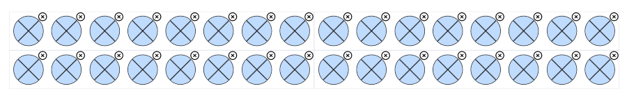
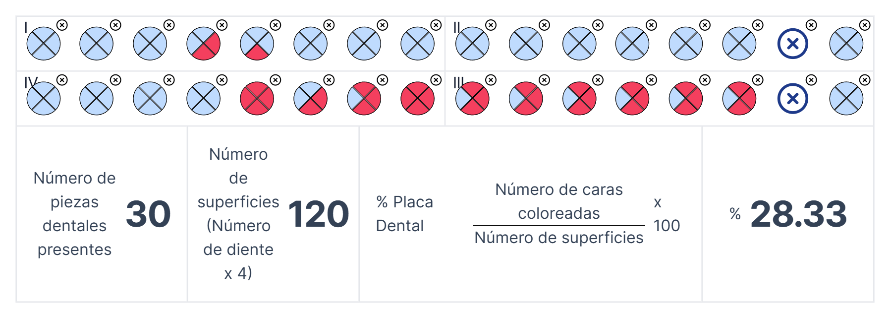

# 🦷 Dental Plaque Chart

<a href='https://www.npmjs.com/package/dental-plaque-chart'></a>

<a href='./LICENSE.txt'></a>

This is a component library for rendering 4-sides dental plaque charts.



You can use this library to create a dental chart for your dental software.
Use the model to save the chart state to the database.

Use the hook to access information about the model. Build a custom UI around the chart using this information.



## 📦 Installation

```shell
npm install dental-plaque-chart
```

## ⚙️ Usage

```js
import {useDentalPlaqueChart, DentalPlaqueChart} from "dental-plaque-chart"

const MyChart = () => {
    // Get a chart model
    const chart = useDentalPlaqueChart()
    
    // Define a size for the container
    return (
        <div style={{width: '800px'}}>
            <DentalPlaqueChart chart={chart}/>
        </div>
    )
}
```

### Disable chart

```js
<DentalPlaqueChart chart={chart} disabled/>
```

### Get model

```js
const chart = useDentalPlaqueChart()
const model = chart.getModel()
// Save model to database
// ...
```

### Set model

```js
const model = // Load model from database...
const chart = useDentalPlaqueChart({model})
```

### Get present dental pieces
    
```js
const count = chart.getPresentDentalPieces() // 0 to 32
```

### Get marked surfaces

```js
const count = chart.getMarkedSurfaces() // 0 to 128
```

### Get plaque percentage

```js
const count = chart.getPlaqueRatio() // 0.0 to 1.0
const percentage = count * 100 // 0% to 100%
```